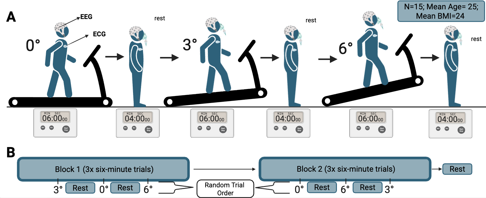

# Background {#intro .column}
Heartbeat-evoked potentials (HEPs) are a type of evoked potential (EP) that serve as a biomarker of interoceptive processing, specifically by reflecting the neural processing of cardiac signals.

**Aim:**  
To determine whether changes in treadmill incline condition alter the amplitude of HEP wave-forms.

**Research Question:**  
Does the high incline condition lead to greater increased mean HEP amplitude in the 250-400ms time window compared to the 50-250ms time window?

**Hypothesis:**  
High incline condition (6°) trials will show a higher mean HEP amplitude than the low incline (0°) and the medium incline (3°) conditions.

# Methods {#methods .column}

HEP waveforms were segmented relative to ECG R-peaks and averaged within two post-heartbeat windows (50–250 ms, 250–400 ms). Mean amplitudes were extracted from midline EEG electrodes (Ch 3, 4, 12, 13).

{width=90%}

(HEP_Amplitude_Boxplots.png)
A linear mixed-effects model was fit with fixed effects of *Condition* (low intensity (0° incline), moderate intensity (3° incline), and high intensity (6° incline)), *Time Window* (50–250 ms, 250–400 ms), and their interaction, controlling for channel differences. Random intercepts and time-window slopes were modeled for each subject:

\[
HEP \sim Condition \times Time + Channel + (1 + Time | Participant)
\]

Significance testing used Type III ANOVA with Satterthwaite approximation.

# Results {#results .column}

The mixed-effects model revealed:

- **Main effect of Condition**: *F*(5, 677) = 5.71, *p* < .001  
- **Time Window**: not significant (*p* = .286)  
- **Condition × Time Window Interaction**: *F*(5, 677) = 2.67, *p* = .021 

Post-hoc contrasts showed:

- Late-window HEP amplitudes were significantly enhanced in the **low and medium incline conditions**
- The **high incline condition did not show a significant late-window increase**

These results indicate that moderate physical load maximally modulates heartbeat-evoked cortical responses.

# Discussion {#discussion .column}
