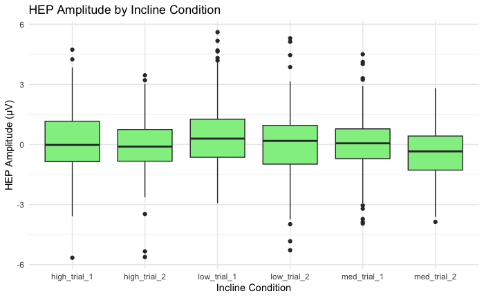

# Background {#intro .column}
Heartbeat-evoked potentials (HEPs) are a type of evoked potential (EP) that serve as a biomarker of interoceptive processing, specifically by reflecting the neural processing of cardiac signals. With each heartbeat, the brain produces a mirror signal, indicating it has received and processed the heartbeat signal. 

**Aim:**  
To determine whether changes in treadmill incline condition alter the amplitude of HEP wave-forms.

**Research Question:**  
Does the high incline condition lead to greater increased mean HEP amplitude in the 250-400ms time window compared to the 50-250ms time window?

**Hypothesis:**  
High incline condition (6°) trials will show a higher mean HEP amplitude than the low incline (0°) and the medium incline (3°) conditions.

# Methods {#methods .column}

{width=90%}

- EEG timepoints were segmented relative to ECG R-peaks and averaged within two post-heartbeat windows (50–250 ms, 250–400 ms).
- Mean HEP amplitudes were extracted from midline anterior cingulate cortex (ACC) EEG electrodes (Ch 3, 4, 12, 13).
- A linear mixed-effects model was fit with fixed effects of 
  - *Condition* (low incline (0°), medium incline (3°), and high incline (6°))
  - *Time Window* (50–250 ms, 250–400 ms)
  - *Condition* x *Time Window* interaction
  - Channel differences

Random intercepts and time-window slopes were modeled for each subject:
\[
HEP \sim Condition \times Time + Channel + (1 + Time | Participant)
\]

Significance testing used Type III ANOVA with Satterthwaite approximation.

# Results {#results .column}

The mixed-effects model revealed:

- **Main effect of Condition**: *F*(5, 677) = 5.71, *p* < .001  
- **Time Window**: not significant (*p* = .286)  
- **Condition × Time Window Interaction**: *F*(5, 677) = 2.67, *p* = .021 

{width=77%}

{width=76%}

{width=75%}

{width=67%}

# Citations

Bainbridge, G. B. (2025). HEP Window Means (v1.0) [Data set]. SIPLab. 

